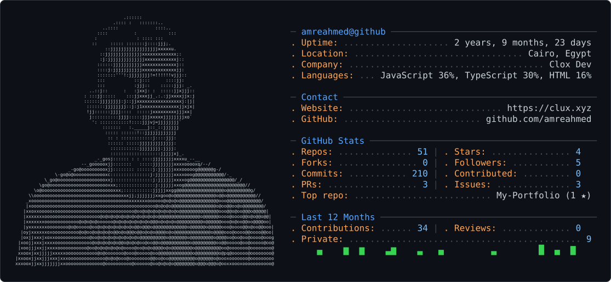

<h1> Hi 👋, I'm Amr Ezzat</h1>

<h2>Computer Engineering Senior | Software & Systems Enthusiast</h2>

<picture>
  <source media="(prefers-color-scheme: dark)" srcset="dark_mode.svg" />
  <source media="(prefers-color-scheme: light)" srcset="light_mode.svg" />
  
</picture>

I'm a senior Computer Engineering student interested in software development, systems programming, and understanding how things work under the hood.

Currently exploring C, Unix/Linux, and low-level programming, while building on my experience in full-stack web development.

<h2>🚀 About Me</h2>

🔭 I'm currently working on Unix Shell projects

🌱 I'm currently learning C, Unix/Linux, and low-level programming

👯 I'm looking to collaborate on C, Unix/Linux, systems programming, and open-source projects

🤝 I'm looking to improve my skills in systems programming and software engineering

💬 Ask me about React, Node.js, JavaScript, and web development

👨‍💻 Check out my projects on my Portfolio

📫 Reach me at amr43103@gmail.com

⚡ Fun fact: I'm fascinated by what happens under the hood — from C code to the Unix shell.

## 🤝 Connect with Me

  
  
  

## 🛠️ Languages & Tools

Systems & Programming

  

Web Development

  

Databases & Infrastructure

  

Other Technologies

  

<h3 align="center">📊 GitHub Stats</h3>

 

 

  <i>Always learning. Always building. Always curious about what's happening under the hood.</i>

